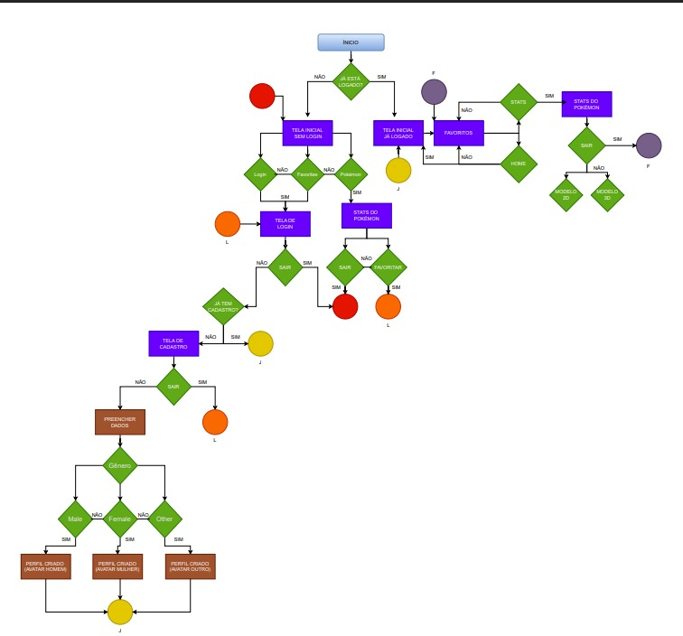
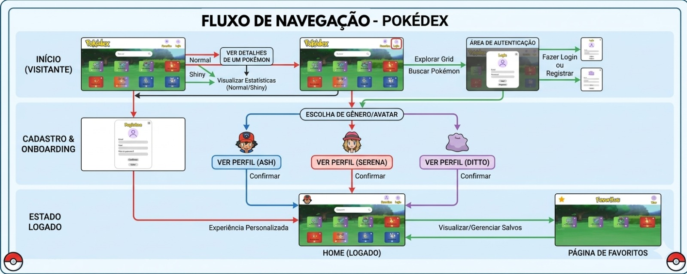
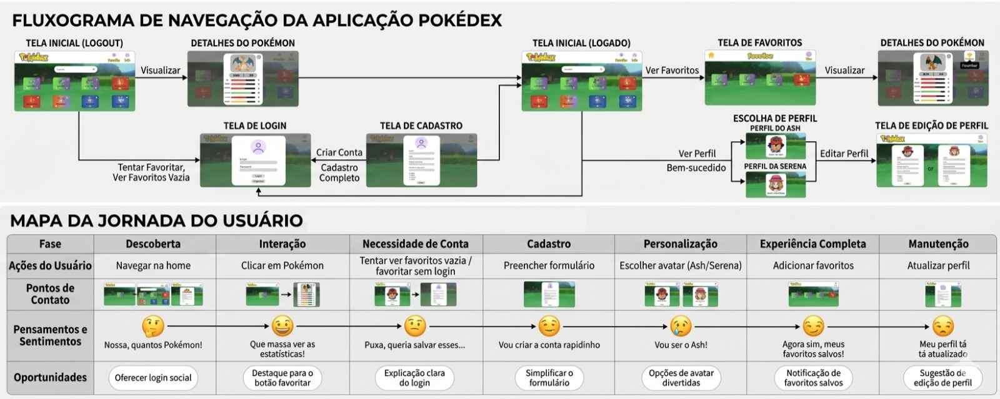

# Solução web usando **html, css e java script** para visualização e salvamento de Pokémons

## Protótipos de alta fidelidade Figma
### Design de alta fidelidade das telas da solução, assim como uma breve introdução ao fluxo do usuário/ de navegação entre as diferentes telas.
 

 

## Fluxo do usuário
### Diagrama representando as interações possiveis do usuário entre as diferentes telas e funcionalidades da solução.

### PDF
<a href="fluxo-do-usuario.pdf" target="_blank">Fluxo do usuario</a>

## Fluxo de navegação
### Esquema demonstrando a navegação do usuário pelas telas do sistema, assim como funcionalidades.

### PDF
<a href="fluxo-de-navegacao" target="_blank">Fluxo de navegacao</a>

## Jornada do usuário
### Mapa representando a experiência do usuario ao longo da sua interação com a solução.

### PDF
<a href="jornada-do-usuario.pdf" target="_blank">Jornada do usuario</a>

