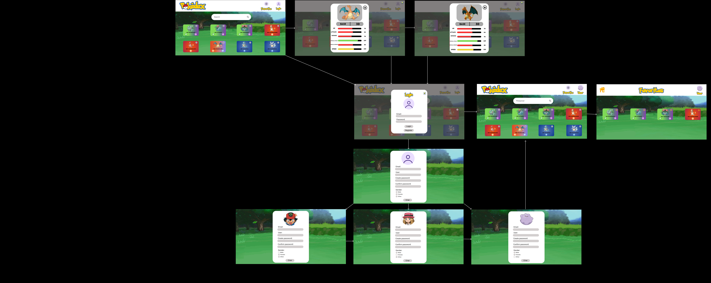

# Solução web usando **html, css e java script** para visualização e salvamento de Pokémons

## Protótipos de alta fidelidade Figma
### Design de alta fidelidade das telas da solução, assim como uma breve introdução ao fluxo do usuário/ de navegação entre as diferentes telas.
 

